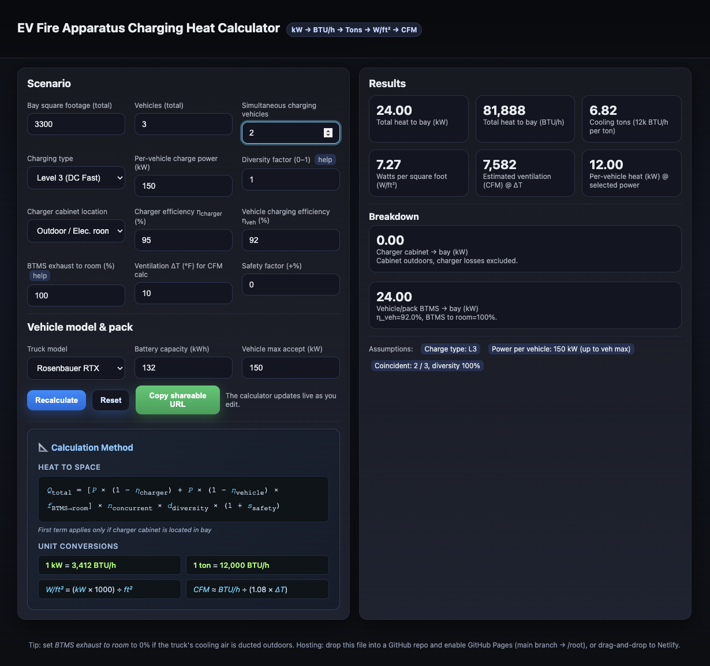

# EV Fire Apparatus Charging Heat Calculator

A single-file web app that estimates sensible heat load from charging electric fire apparatus (e.g., Rosenbauer RTX, Pierce Volterra, E-ONE Vector). It converts charging losses into kW, BTU/h, cooling tons, W/ft², and CFM so you can right-size HVAC and ventilation for apparatus bays.

Why? During DC fast charging, both the charger cabinet and the vehicle battery thermal management system (BTMS) reject heat to ambient. This tool helps you model that heat under different scenarios—truck counts, charger power/level, cabinet location, efficiencies, and more.

⸻

✨ Features
	•	Truck presets + custom entry (pack size & max accept kW)
	•	Level 2 vs Level 3 charging
	•	Charger cabinet location: in-bay vs outdoors/electrical room
	•	Efficiencies & BTMS fraction controls
	•	Simultaneous charging + diversity factor for coincident peak
	•	Results: kW, BTU/h, tons, W/ft², CFM at chosen ΔT°F
	•	Per-vehicle and total heat breakdown
	•	Shareable URL: settings are encoded in the query string
	•	Zero build tooling: one index.html, host anywhere
	•	Polished math panel rendered with KaTeX

⸻

🚀 Quick Start
	1.	Download index.html from this repo.
	2.	Open it in any modern browser — or host it on a static site:
	•	GitHub Pages: push to a repo → Settings → Pages → “Deploy from a branch” (root).
	•	Netlify: drag-and-drop the file onto the dashboard.

No server, dependencies, or build steps required.

⸻

🧮 How it Calculates

### How it Calculates

**Per-vehicle heat to bay (kW)**  

$$
Q_{\text{veh}} =
P \Big[
(1-\eta_{\text{charger}})_{\text{(if cabinet in bay)}} +
(1-\eta_{\text{vehicle}})\, f_{\text{BTMS→room}}
\Big]
$$

**Total heat (kW)**  

$$
Q_{\text{total}} =
Q_{\text{veh}} \times N_{\text{simultaneous}}
\times f_{\text{diversity}}
\times (1 + \text{safety\%})
$$

**Conversions**

$$
1\,\text{kW} = 3412\,\text{BTU/h}
$$
$$
\text{Tons} = \frac{\text{BTU/h}}{12000}
$$
$$
W/\text{ft}^2 = \frac{1000 \times \text{kW}}{\text{bay ft}^2}
$$
$$
\text{CFM} \approx \frac{\text{BTU/h}}{1.08 \times \Delta T_{^{\circ}\mathrm{F}}}
$$

> **Tip:** Set _BTMS exhaust to room = 0 %_ if the truck’s cooling air is fully ducted outdoors.
> 
⸻

🔧 Inputs & Controls
	•	Bay square footage (total)
	•	Total trucks and Charging simultaneously
	•	Charging type: Level 2 (AC) or Level 3 (DC fast)
	•	Per-vehicle charge power (kW)
	•	Charger cabinet location: In-bay or Outdoor/Electrical room
	•	Efficiencies: η_charger, η_vehicle
	•	BTMS exhaust to bay (%): portion of vehicle-side heat into the room
	•	Diversity factor (0–1): coincident load reduction
	•	ΔT°F: for CFM estimation
	•	Safety factor (%): design headroom
	•	Model preset: RTX / Volterra / Vector / Custom (pack kWh, max accept kW)

⸻

📌 Preset Models (editable)
	•	Rosenbauer RTX — 132 kWh, ~150 kW accept
	•	Pierce Volterra — 246 kWh, ~150 kW accept
	•	E-ONE Vector — 327 kWh, ~200 kW accept
	•	Custom — pick your own values

You can tweak pack size and maximum accept rate to match your unit’s spec sheet.

⸻

🔗 Share Scenarios

The app writes your current settings to the page URL (query string).
Just copy the address bar to share an exact scenario with colleagues.

⸻

🧪 Example Use
	•	Bay: 3,300 ft²
	•	Trucks: 2 total, 1 simultaneous
	•	Level 3 at 150 kW
	•	Cabinet: Outdoor
	•	η_charger 95%, η_vehicle 92%
	•	BTMS to room 100%
	•	Diversity 1.0, ΔT 10°F

The results panel shows total kW, BTU/h, tons, W/ft², CFM, and per-vehicle heat.
Increase “Simultaneous” to see how peak load scales; set BTMS to 0% if you can duct exhaust outside.

⸻

🧱 Assumptions & Notes
	•	Heat scales roughly linearly with charge power and number of simultaneous vehicles.
	•	If the charger cabinet is indoors, add its losses; if outdoors, exclude them.
	•	η_vehicle varies with SOC and C-rate. Using 92% is a reasonable, conservative midpoint for fast charging.
	•	This tool estimates sensible loads only and is meant for preliminary HVAC sizing. Always confirm with OEMs and your AHJ.

⸻

🖼️ Screenshot

⸻

🤝 Contributing

Issues and PRs are welcome—bug fixes, new presets, UX improvements, or additional outputs (e.g., energy per session, site DC power caps).

⸻

📝 License

GPL 3. See LICENSE for details.
