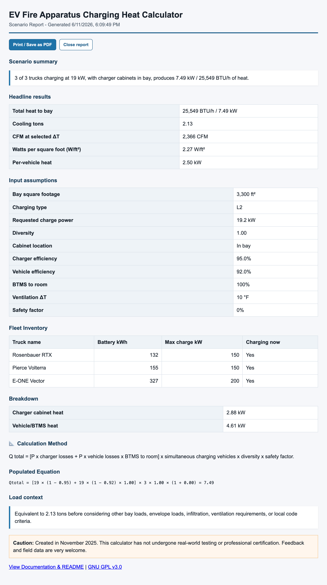

# EV Fire Apparatus Charging Heat Calculator

**Current version: 2.3.0


<p>
  A browser-based HVAC planning calculator for estimating sensible heat load from EV fire apparatus charging (e.g., Rosenbauer RTX, Pierce Volterra, E-ONE Vector). The app converts charger and vehicle losses into electrical and HVAC planning units so apparatus bay loads can be reviewed in kW, BTU/h, refrigeration tons, load intensity, and ventilation or airflow terms.
</p>

The calculator runs from the static [`index.html`](index.html) file and supports I-P and SI units, multiple languages, saved scenarios, shareable URLs, and printable localized HTML reports.

> ⚠️ **Caution:** Created in November 2025. This calculator has not undergone real-world testing or professional certification. Confirm assumptions with OEMs, qualified HVAC designers, and the authority having jurisdiction.

---

###### Use the caluclator: https://blackrockcity.github.io/EV-Fire-Apparatus-Charging-Heat-Calculator

---

###### ☕ https://buymeacoffee.com/blackrockcity

---

## Features

### Fleet and Charging Setup

- Editable truck inventory with vehicle name, battery size, maximum charge rate, and charging status.
- Built-in electric fire apparatus presets, plus fully custom truck entries.
- Built-in example scenarios for common charging arrangements.
- Support for both Level 2 and Level 3 charging.
- Charger cabinet location control for in-bay equipment versus outdoor or electrical-room equipment.
- Simultaneous charging controls, including diversity factor for estimating coincident peak load.

### Heat Load Modeling

- Adjustable charger efficiency, vehicle charging efficiency, and BTMS heat-to-room fraction.
- Per-vehicle and total heat breakdown.
- Results shown as kW, BTU/h, refrigeration tons, load intensity, and ventilation airflow.
- Ventilation airflow estimate based on the selected temperature rise.
- Calculation method and populated equation shown directly in the app and report.
- Polished math panel rendered with KaTeX.

### Units and Localization

- Unit selector for Imperial / I-P and Metric / SI workflows.
- I-P and SI outputs, with kW retained in both modes.
- Language selector with localized interface and report text for ***31 major languages!***
- RTL layout mirroring for Arabic, Urdu, Persian/Farsi, and Hebrew, while keeping formulas and equation blocks LTR for readability.

### Scenarios, Sharing, and Reports

- Saved scenarios stored in browser `localStorage`.
- Shareable URLs that encode the current scenario state.
- Share URLs include `units=ip|si` so shared scenarios reopen with the intended unit system.
- HTML report mode for creating a clean engineering-style summary.
- Browser `Print / Save as PDF` support for reports.

### Reliability and Safety

- Hardened input validation with safe limits.
- Bounded URL and inventory parsing to avoid malformed or oversized shared scenarios.
- Escaped report content and sanitized scenario data.
- Automated Vitest and Playwright regression tests.

### Deployment and Maintenance

- Single-file app built around `index.html`.
- Can be opened locally or hosted as a static site.
- No server required for normal use.

## Quick Start

Use the hosted app:

[https://blackrockcity.github.io/EV-Fire-Apparatus-Charging-Heat-Calculator](https://blackrockcity.github.io/EV-Fire-Apparatus-Charging-Heat-Calculator)

Or open [`index.html`](index.html) directly in a modern browser.

1. Pick a language.
2. Pick units: `Imperial / I-P` or `Metric / SI`.
3. Add trucks to the fleet inventory.
4. Select which trucks are charging now.
5. Adjust bay area, charge power, efficiencies, BTMS, diversity, and safety factor.
6. Review the results and populated equation.
7. Open the HTML report or copy the share URL.

No `npm` install is required for normal calculator use.

## How it Calculates

**Per-vehicle heat to bay (kW)**

$$
Q_{\text{veh}} =
P \Big[
(1-\eta_{\text{charger}})_{\text{(if cabinet in bay)}} +
(1-\eta_{\text{vehicle}})\, f_{\text{BTMS→room}}
\Big]
$$

**Total heat (kW)**

$$
Q_{\text{total}} =
Q_{\text{veh}} \times N_{\text{simultaneous}}
\times f_{\text{diversity}}
\times (1 + \text{safety\%})
$$

**Conversions**

$$
1\,\text{kW} = 3412\,\text{BTU/h}
$$

$$
\text{Tons} = \frac{\text{BTU/h}}{12000}
$$

$$
W/\text{ft}^2 = \frac{1000 \times \text{kW}}{\text{bay ft}^2}
$$

$$
\text{CFM} \approx \frac{\text{BTU/h}}{1.08 \times \Delta T_{^{\circ}\mathrm{F}}}
$$

For SI display, the app converts bay area, airflow, load intensity, and ΔT to metric units while preserving the same underlying heat calculation.

> **Tip:** Set _BTMS exhaust to room = 0 %_ if the truck’s cooling air is fully ducted outdoors.

## Assumptions & Notes

- Heat scales roughly linearly with charge power and number of simultaneous vehicles.
- If the charger cabinet is indoors, add its losses; if outdoors, exclude them.
- η_vehicle varies with SOC and C-rate. Using 92% is a conservative midpoint for fast charging.
- This tool estimates **sensible loads only** and is intended for preliminary HVAC sizing. Always confirm with OEMs and your AHJ.

## Input Limits and Hardening

- Maximum trucks: `100`
- Maximum bay area: `200,000 ft²` or about `18,600 m²`
- Maximum Level 3 requested charge power: `2,000 kW`
- Level 2 charge cap: `19.2 kW`
- Maximum vehicle acceptance rate: `2,000 kW`
- Charger and vehicle efficiency range: `80–99.9%`
- BTMS to room: `0–100%`
- Diversity: `0–1`
- Safety factor: `0–100%`
- URL inventory parsing is bounded.
- Malformed shared URL data is ignored safely.
- Truck names and report content are escaped or sanitized.
- Oversized inventories are capped.

## Presets and Saved Scenarios

Built-in presets replace the current scenario, and all preset values can be edited afterward.

#### Built-in Vehicle Presets

The calculator includes built-in presets for several electric fire apparatus examples. These presets are intended as starting points for planning and comparison. After loading a preset, you can edit the truck name, battery size, requested charging power, and charging status to match your actual fleet or project assumptions.

- **Rosenbauer RTX:** 132 kWh battery, about 150 kW maximum charging power
- **Pierce Volterra:** 246 kWh battery, about 150 kW maximum charging power
- **E-ONE Vector:** 327 kWh battery, about 200 kW maximum charging power
- **Custom:** user-defined battery size, charging power, and description

#### Saved Scenarios

Saved scenarios are stored locally in the user's browser using `localStorage`. They are not uploaded anywhere. Clearing browser storage can delete saved scenarios.

Saved scenario names are sanitized, and saved scenario data is normalized through the same validation path as loaded/shared data. Saved scenarios store canonical engineering values plus unit metadata so they can render safely under either I-P or SI display.

## Share URLs

The app writes scenario state to the URL query string so scenarios can be shared. Current URLs include `units=ip` or `units=si`. Older URLs without a `units` parameter still load and default according to the current language/unit rules.

## Reports

`Open Report` opens a polished HTML report in a new tab or window. The report uses the current language and unit system.

Reports include:

- Scenario summary
- Headline results
- Input assumptions
- Fleet inventory
- Heat breakdown
- Calculation method
- Populated equation
- Load context
- Caution text and links

`Print / Save as PDF` uses the browser print dialog. `Close report` closes the report window.

## Example Use

Fresh defaults and an example truck setup:

- Fresh I-P bay-area default: `3,300 ft²`
- Fresh SI bay-area default: `300 m²`
- Truck: one Rosenbauer RTX charging
- Requested charge power: `150 kW`
- Charger cabinet: in bay
- Ventilation delta T: `10°F` / about `5.6°C`

In I-P mode, the headline emphasizes BTU/h and the secondary cards show W/ft² and CFM. In SI mode, the headline emphasizes kW and the secondary cards show W/m² and m³/h, with BTU/h and refrigeration tons retained as references.

## Languages

Supported languages:

<table>
<tr>
<td>

- English
- Simplified Chinese
- Spanish
- French
- German
- Japanese
- Korean
- Portuguese
- Arabic
- Hindi
- Bengali

</td>
<td>

- Indonesian
- Urdu
- Russian
- Italian
- Vietnamese
- Turkish
- Thai
- Persian / Farsi
- Swahili
- Traditional Chinese
- Dutch
- Polish
- Swedish

</td>
<td>

- Danish
- Norwegian Bokmål
- Finnish
- Czech
- Greek
- Hebrew
- Hungarian

</td>
</tr>
</table>

The language selector controls UI and report text. The units selector controls engineering units. They are separate because bilingual users may work in different engineering systems.

Arabic, Urdu, and Persian/Farsi intentionally use RTL layout mirroring. Formula, calculation method, unit-conversion, and populated equation blocks remain LTR for engineering readability.

## Units

Language controls UI and report text. Units controls engineering units. English defaults to I-P; non-English languages default to SI unless manually overridden. Manual unit overrides persist in `localStorage`.

Fresh defaults:

- I-P bay area: `3,300 ft²`
- SI bay area: `300 m²`

### Imperial / I-P

- Bay area input: `ft²`
- Ventilation delta T input: `°F`
- Airflow output: `CFM`
- Load intensity: `W/ft²`
- Headline result is BTU/h-first
- `kW` and refrigeration tons remain visible

### Metric / SI

- Bay area input: `m²`
- Ventilation delta T input: `°C`
- Airflow output: `m³/h`
- Optional `L/s` equivalent is shown where applicable
- Load intensity: `W/m²`
- Headline result is kW-first
- `BTU/h` and refrigeration tons remain visible as references

### Unit Conversions

- `1 ft² = 0.09290304 m²`
- `1 m² = 10.7639104167 ft²`
- `ΔT°F = ΔT°C × 1.8`
- `ΔT°C = ΔT°F / 1.8`
- `1 CFM = 1.69901082 m³/h`
- `1 CFM = 0.47194745 L/s`
- `1 W/ft² = 10.7639104167 W/m²`
- `1 kW = 3,412 BTU/h`
- `1 refrigeration ton = 12,000 BTU/h ≈ 3.517 kW`

Delta T conversion is a temperature-difference conversion, not an absolute temperature conversion. Do not add or subtract 32 when converting `ΔT`.

Internal calculations use canonical I-P values while display values are converted for I-P or SI. User-edited values, presets, saved scenarios, and share URLs convert directly and may display non-round equivalents.

## Development and Testing

Install dependencies:

```bash
npm install
```

Run the unit/jsdom regression suite:

```bash
npm test
```

Run browser tests:

```bash
npm run test:e2e
```

If Playwright browsers are not installed yet:

```bash
npx playwright install
```

Test coverage includes hardening, regression calculations, localization completeness, placeholder translation checks, I-P/SI unit switching, report generation, saved scenarios, share URLs, and browser smoke tests.

## Project Files

Normal users only need the hosted page or `index.html`. Developers run npm commands from the repository root.

- [`index.html`](index.html): static end-user app
- [`package.json`](package.json): npm metadata and test scripts
- [`package-lock.json`](package-lock.json): locked dependency tree
- [`dev/configs/vitest.config.js`](dev/configs/vitest.config.js): Vitest configuration
- [`dev/configs/playwright.config.js`](dev/configs/playwright.config.js): Playwright configuration
- [`dev/tests/calculator.hardening.test.js`](dev/tests/calculator.hardening.test.js): jsdom hardening and regression tests
- [`dev/tests/e2e/calculator.browser.spec.js`](dev/tests/e2e/calculator.browser.spec.js): real-browser Playwright tests

## Repository Hygiene

Commit:

- Source files
- README and documentation
- `package.json` and `package-lock.json`
- Test files
- Configuration files

Do not commit:

- `node_modules/`
- `coverage/`
- `playwright-report/`
- `test-results/`
- `.DS_Store`

## Screenshot

### Calculator App


### Printable Report



## Version History

- `2.3.0`: Dutch, Polish, Swedish, Danish, Norwegian Bokmål, Finnish, Czech, Greek, Hebrew, and Hungarian localization, including Hebrew RTL support and population-center emoji markers in the language selector.
- `2.2.0`: Bengali, Indonesian, Urdu, Russian, Italian, Vietnamese, Turkish, Thai, Persian/Farsi, Swahili, and Traditional Chinese localization, including localized reports and RTL support for Urdu and Persian.
- `2.1.0`: I-P/SI unit selector, localized unit displays, localized reports with units, share URL unit state, saved scenario unit metadata.
- `2.0.0`: hardening, automated tests, localization, presets/saved scenarios, HTML report mode.
- Earlier versions: initial single-file calculator.

## 🤝 Contributing

Issues and PRs are welcome for bug fixes, new presets, UX improvements, additional languages, documentation updates, or additional outputs such as energy per session or site DC power caps.

## License

GPL v3.0 — see LICENSE for details.

## Support this project

☕ https://buymeacoffee.com/blackrockcity
