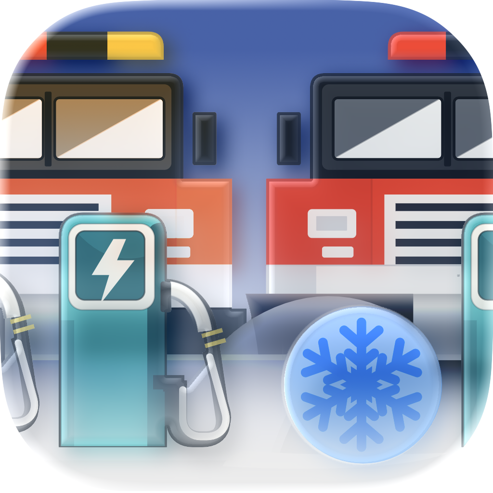
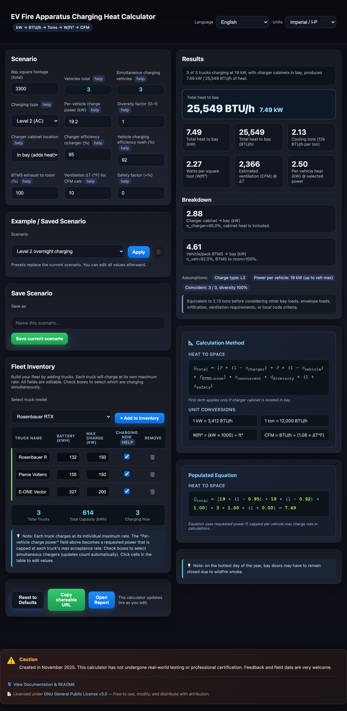

# EV Fire Apparatus Charging Heat Calculator

**Current version: 2.4.0**

  A browser-based HVAC planning calculator for estimating sensible heat load from EV fire apparatus charging (e.g., Rosenbauer RTX, Pierce Volterra, E-ONE Vector). The app converts charger and vehicle losses into electrical and HVAC planning units so apparatus bay loads can be reviewed in kW, BTU/h, refrigeration tons, load intensity, and ventilation or airflow terms.

The calculator runs from the static [`index.html`](index.html) file and supports I-P and SI units, multiple languages, saved scenarios, shareable URLs, and printable localized HTML reports.

> ⚠️ **Caution:** Created in November 2025. This calculator has not undergone real-world testing or professional certification. Confirm assumptions with OEMs, qualified HVAC designers, and the authority having jurisdiction.

---

###### Use the calculator: https://blackrockcity.github.io/EV-Fire-Apparatus-Charging-Heat-Calculator

---

###### ☕ https://buymeacoffee.com/blackrockcity

---

## Documentation

Choose the guide that matches what you need:

| I want to... | Documentation |
|---|---|
| Use the calculator and understand its inputs, results, scenarios, reports, languages, and units | [User Guide](docs/USER_GUIDE.md) |
| Review the equations, engineering assumptions, limits, conversions, and apparatus presets | [Technical Reference](docs/TECHNICAL_REFERENCE.md) |
| Examine the calculator's testing and current validation status | [Validation and Verification](docs/VALIDATION.md) |
| Run, test, modify, host, or contribute to the application | [Development Guide](docs/DEVELOPMENT.md) |

## Features

### Fleet and Charging Setup

- Editable truck inventory with vehicle name, battery size, maximum charge rate, and charging status.
- Built-in electric fire apparatus presets, plus fully custom truck entries.
- Built-in example scenarios for common charging arrangements.
- Support for both Level 2 and Level 3 charging.
- Charger cabinet location control for in-bay equipment versus outdoor or electrical-room equipment.
- Simultaneous charging controls, including diversity factor for estimating coincident peak load.

### Heat Load Modeling

- Adjustable charger efficiency, vehicle charging efficiency, and BTMS heat-to-room fraction.
- Per-vehicle and total heat breakdown.
- Results shown as kW, BTU/h, refrigeration tons, load intensity, and ventilation airflow.
- Ventilation airflow estimate based on the selected temperature rise.
- Calculation method and populated equation shown directly in the app and report.
- Polished math panel rendered with KaTeX.

### Units and Localization

- Unit selector for Imperial / I-P and Metric / SI workflows.
- I-P and SI outputs, with kW retained in both modes.
- Language selector with localized interface and report text for ***31 major languages!***
- RTL layout mirroring for Arabic, Urdu, Persian/Farsi, and Hebrew, while keeping formulas and equation blocks LTR for readability.

### Scenarios, Sharing, and Reports

- Saved scenarios stored in browser `localStorage`.
- Shareable URLs that encode the current scenario state.
- Share URLs include `units=ip|si` so shared scenarios reopen with the intended unit system.
- HTML report mode for creating a clean engineering-style summary.
- Browser `Print / Save as PDF` support for reports.
- Excel `.xlsx` `Download Excel` support for report data.

### Reliability and Safety

- Hardened input validation with safe limits.
- Bounded URL and inventory parsing to avoid malformed or oversized shared scenarios.
- Escaped report content and sanitized scenario data.
- Automated Vitest and Playwright regression tests.

### Deployment and Maintenance

- Single-file app built around `index.html`.
- Can be opened locally or hosted as a static site.
- No server required for normal use.

## Quick Start

Use the hosted app:

[https://blackrockcity.github.io/EV-Fire-Apparatus-Charging-Heat-Calculator](https://blackrockcity.github.io/EV-Fire-Apparatus-Charging-Heat-Calculator)

Or open [`index.html`](index.html) directly in a modern browser.

1. Pick a language.
2. Pick units: `Imperial / I-P` or `Metric / SI`.
3. Add trucks to the fleet inventory.
4. Select which trucks are charging now.
5. Adjust bay area, charge power, efficiencies, BTMS, diversity, and safety factor.
6. Review the results and populated equation.
7. Open the HTML report or copy the share URL.

No `npm` install is required for normal calculator use.

For detailed operating instructions, see the [User Guide](docs/USER_GUIDE.md).

## Screenshot

### Calculator App

### Printable Report

## Version History

- `2.4.0`: Added Excel/XLSX report export from generated scenario reports, with calculation-friendly numeric cells and separated units for downstream spreadsheet use.
- `2.3.1`: Persian/Farsi and Swedish localization refinements plus integrated non-sticky header treatment.
- `2.3.0`: Dutch, Polish, Swedish, Danish, Norwegian Bokmål, Finnish, Czech, Greek, Hebrew, and Hungarian localization, including Hebrew RTL support and population-center emoji markers in the language selector.
- `2.2.0`: Bengali, Indonesian, Urdu, Russian, Italian, Vietnamese, Turkish, Thai, Persian/Farsi, Swahili, and Traditional Chinese localization, including localized reports and RTL support for Urdu and Persian.
- `2.1.0`: I-P/SI unit selector, localized unit displays, localized reports with units, share URL unit state, saved scenario unit metadata.
- `2.0.0`: hardening, automated tests, localization, presets/saved scenarios, HTML report mode.
- Earlier versions: initial single-file calculator.

## 🤝 Contributing

Issues and PRs are welcome for bug fixes, new presets, UX improvements, additional languages, documentation updates, or additional outputs such as energy per session or site DC power caps.

See the [Development Guide](docs/DEVELOPMENT.md) for the repository layout, test commands, and contribution details.

## License

GPL v3.0 — see LICENSE for details.

## Support this project

☕ https://buymeacoffee.com/blackrockcity
